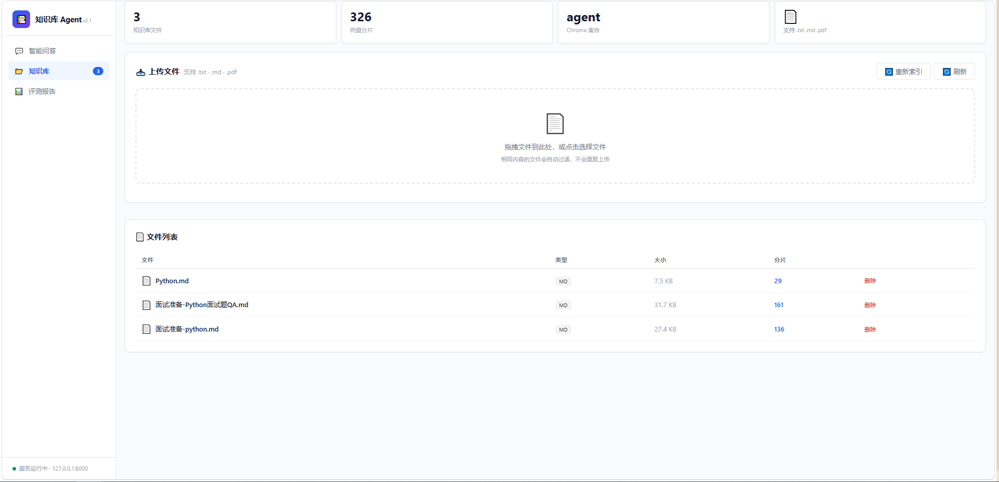
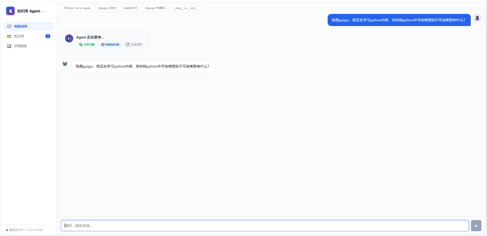
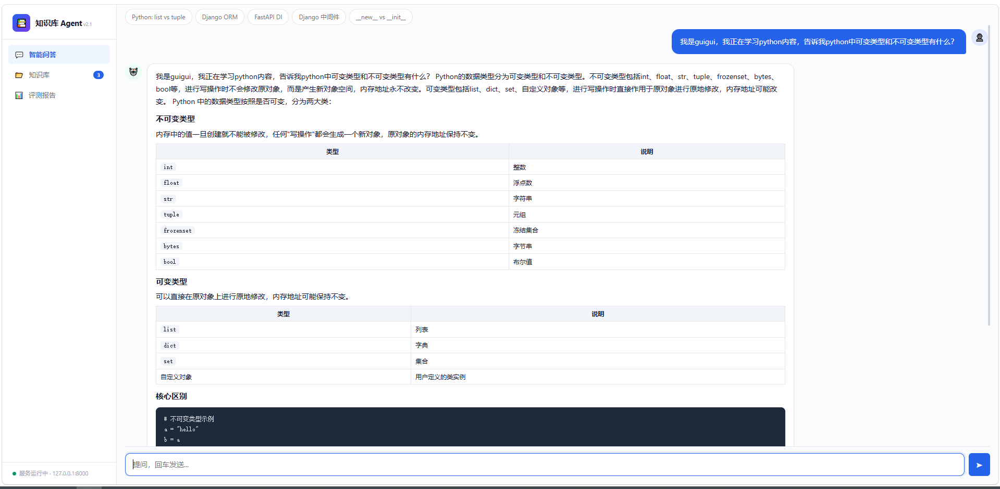
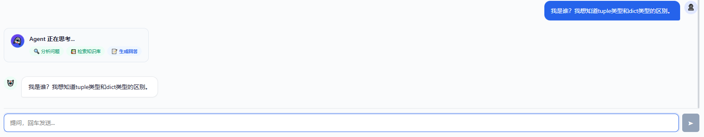
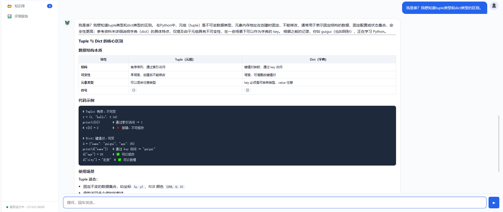
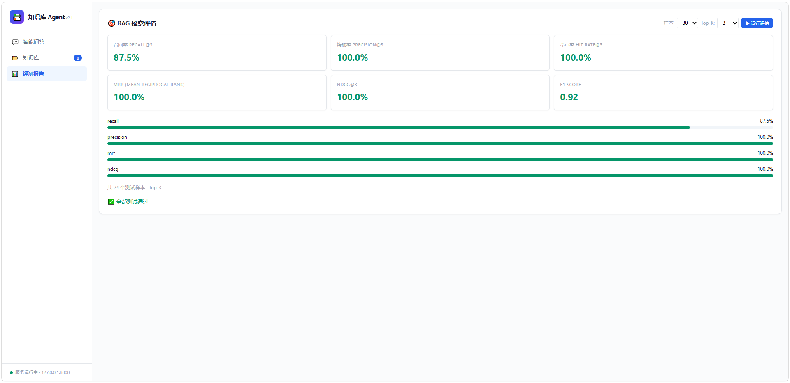

# Knowledge Agent — 个人知识库智能问答系统

基于 **LangChain ReAct Agent + RAG** 的通用知识库问答系统，支持多轮对话、长期记忆、流式输出和自动化评估。

> 技术栈：FastAPI · LangChain · Chroma · 通义千问 · SSE 流式 · Docker

---

## 项目亮点

- **ReAct Agent 智能推理**：LLM 自主决定调用哪些工具、以什么顺序调用，而非预设流程
- **RAG 检索增强生成**：知识库文档 → 向量化 → 语义检索 → LLM 生成，解决幻觉问题
- **双重记忆系统**：短期记忆（会话上下文）+ 长期记忆（SQLite + Chroma 双写，跨会话持久化）
- **三种通信协议**：REST API（同步）+ SSE（流式）+ WebSocket（双向）
- **完整的评估体系**：Recall / Precision / MRR / NDCG / F1 / Hit Rate 六大指标
- **工程化完备**：Docker 一键部署 · 日志系统 · 会话管理 · 单元测试

---

## 系统架构

```
┌─────────────────────────────────────────────────────────┐
│                      前端 (static/)                      │
│       聊天界面 · 知识库管理 · 评测报告                    │
│       HTML/CSS/JS + SSE 流式 + Markdown 渲染             │
└────────────────────┬────────────────────────────────────┘
                     │ SSE / REST / WebSocket
┌────────────────────▼────────────────────────────────────┐
│                   FastAPI (server.py)                    │
│  /api/chat/stream       /api/chat/sync    /api/ws/chat  │
│  /api/knowledge/*       /api/evaluation/*  /api/session/*│
└────────┬────────────────────────────────────────┬───────┘
         │                                        │
┌────────▼────────────────┐    ┌─────────────────▼────────┐
│     ReAct Agent         │    │   RAG 检索引擎            │
│  create_agent (LangChain)│    │  Chroma 向量数据库       │
│  4 工具 + 2 中间件      │    │  text-embedding-v4       │
└────────┬────────────────┘    └─────────────────┬────────┘
         │                                       │
         │    ┌─────────────────┐                │
         ├───►│  记忆系统        │◄───────────────┘
         │    │ SQLite + Chroma  │
         │    │ MemoryExtractor  │
         │    └─────────────────┘
         │
         ▼
┌─────────────────┐
│   通义千问       │
│   qwen3.7-max   │
└─────────────────┘
```

---

## 系统预览

### 1. 知识库
系统能够准确理解用户意图，从本地知识库中检索相关信息并生成自然流畅的回答。



### 2. Agent 思考
展示 Agent 在处理复杂问题时的内部推理路径（Thought）与最终回答（Answer）。

| 问题 | 思考过程 (Thought) | 最终回答 (Answer) |
| :--- | :--- | :--- |
| **问题 1** |  |  |
| **问题 2** |  |  |

### 3. 评估体系
RAG 系统的质量需要量化评估——你改了检索策略后，怎么知道变好了还是变坏了？

**六大核心指标：**

| 指标 | 计算方式 | 含义 |
|------|---------|------|
| **Recall@K** | 前K个结果中相关文档数 / 总相关文档数 | 找全了吗？ |
| **Precision@K** | 前K个结果中相关文档数 / K | 找对了吗？ |
| **MRR** | 第1个相关文档排名的倒数 | 排得靠前吗？ |
| **NDCG@K** | 对排序质量加权打分 | 排得准吗？ |
| **F1 Score** | 2*P*R/(P+R) | 综合平衡 |
| **Hit Rate** | 是否至少命中一个 | 有没有？ |



## 快速开始

### 前提条件

- Python 3.13+
- 阿里云百炼 API Key（[申请地址](https://bailian.console.aliyun.com/)）

### 1. 克隆并配置

```bash
git clone <repo-url>
cd LangChain-ReAct-Agent

# 复制环境变量模板，填入你的 API Key
cp .env.example .env
```

编辑 `.env`，填入你的阿里云百炼 API Key：
```
API_KEY=sk-your-api-key-here
```

### 2. 本地运行

```bash
# 创建虚拟环境
python -m venv .venv
source .venv/bin/activate  # Linux/Mac
# .venv\Scripts\activate   # Windows

# 安装依赖
pip install -r requirements.txt

# 启动服务
python server.py
```

访问：
- 前端 UI：http://localhost:8080
- API 文档：http://localhost:8080/api/docs

### 3. Docker 运行

```bash
docker-compose up -d
```

---

## API 接口

| 方法 | 路径 | 说明 |
|------|------|------|
| `POST` | `/api/chat/stream` | SSE 流式聊天（逐字推送） |
| `POST` | `/api/chat/sync` | 同步聊天（等待完整回复） |
| `WebSocket` | `/api/ws/chat` | WebSocket 双向聊天 |
| `POST` | `/api/knowledge/upload` | 上传知识库文件 |
| `GET` | `/api/knowledge/stats` | 知识库统计 |
| `DELETE` | `/api/knowledge/{filename}` | 删除知识库文件 |
| `POST` | `/api/knowledge/reindex` | 重建索引 |
| `POST` | `/api/evaluation/run` | 运行 RAG 评估 |
| `GET` | `/api/evaluation/results` | 查看评估结果 |
| `GET` | `/api/health` | 健康检查 |
| `POST` | `/api/session` | 创建新会话 |
| `GET` | `/api/session/{id}` | 获取会话信息 |
| `DELETE` | `/api/session/{id}` | 删除会话 |

---

## 项目结构

```
├── agent/                   # ReAct Agent 核心
│   ├── react_agent.py       # Agent 定义（4工具+2中间件）
│   └── tools/
│       ├── agent_tools.py   # 工具（RAG/时间/记忆）
│       └── middleware.py    # 中间件（日志/动态提示词）
├── api/                     # FastAPI 路由层
│   ├── routes.py            # 聊天 API（REST/SSE/WebSocket）
│   ├── knowledge.py         # 知识库管理 API
│   ├── evaluation.py        # 评估 API
│   └── schemas.py           # 请求/响应数据模型
├── core/                    # 核心配置
│   ├── config.py            # Settings 单例（所有配置项）
│   ├── constants.py         # 全局常量
│   └── exceptions.py        # 自定义异常
├── context/                 # 上下文管理
│   ├── session_manager.py   # 会话生命周期（创建/过期/清理）
│   ├── tracker.py           # 对话状态跟踪（意图/实体/槽位）
│   ├── parser.py            # 指令解析器
│   └── schemas.py           # 对话数据模型
├── evaluation/              # 评估体系
│   ├── evaluator.py         # 评估 Pipeline
│   ├── metrics.py           # Recall/Precision/MRR/NDCG/F1/Hit
│   └── benchmark.py         # 自动生成测试数据集
├── memory/                  # 长期记忆系统
│   ├── store.py             # SQLite + Chroma 双写存储
│   ├── extractor.py         # LLM 驱动记忆提取
│   └── schemas.py           # 记忆数据模型
├── model/                   # 模型工厂
│   └── factory.py           # ChatOpenAI + DashScopeEmbeddings
├── rag/                     # RAG 检索增强生成
│   ├── vector_store.py      # Chroma 向量库服务
│   └── rag_service.py       # RAG 链式调用
├── utils/                   # 工具模块
│   ├── file_handler.py      # 文件加载（PDF/TXT/MD）
│   ├── prompt_loader.py     # 提示词加载
│   ├── config_handler.py    # YAML 配置加载
│   ├── logger_handler.py    # 日志系统
│   └── path_tool.py         # 路径工具
├── prompts/                 # 提示词模板
│   ├── main_prompt.txt      # 主系统提示词
│   ├── rag_summarize.txt    # RAG 概要提示词
│   └── report_prompt.txt    # 报告生成提示词
├── config/                  # YAML 配置文件
│   ├── agent.yml
│   ├── chroma.yml
│   ├── rag.yml
│   └── prompts.yml
├── tests/                   # 单元测试
│   ├── conftest.py
│   ├── test_context.py      # 会话管理测试
│   └── test_memory.py       # 记忆系统测试
├── docs/
│   └── 教学文档.md           # 知识点 + 代码案例教学
├── static/
│   └── index.html           # 前端 SPA（3 Tab）
├── server.py                # FastAPI 入口
├── Dockerfile
├── docker-compose.yml
├── requirements.txt
└── .env.example
```

---

## 核心技术决策

### 用 ReAct Agent 而不是普通 RAG 链

普通 RAG 链是固定流程：检索 → 拼接 → 生成。ReAct Agent 能**自主决策**——什么时候检索、检索什么、是否需要多次检索、是否调用其他工具。这使系统更灵活、更通用。

### 用 SQLite + Chroma 双写做长期记忆

Chroma 擅长语义检索但不够擅长关系型查询（分类统计、时间排序）。SQLite 补充了这一缺口。两者互补实现了「检索快、查询全」的效果。

### 评估 RAG 检索质量

改了分块策略或嵌入模型后，检索效果可能变好也可能变差。量化评估（Recall/MRR/NDCG）让改进方向有据可依，而不是凭感觉。

---

## 启动与测试

```bash
# 启动服务
python server.py

# 运行测试
pytest tests/ -v

# 代码格式化（如果使用 ruff）
# ruff check . --fix
```

---
